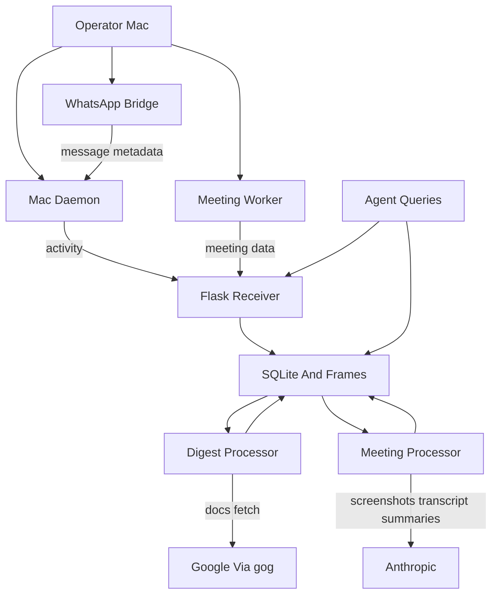

# ClawRelay Threat Model

## Executive summary
ClawRelay is a private, Tailscale-only coordination system, but it processes extremely sensitive operator context and concentrates both read and write power behind a single bearer token. The highest-risk themes are: intentional disclosure of sensitive meeting and document content to third parties when Anthropic and `gog` are enabled, single-secret compromise leading to total confidentiality and integrity failure across all APIs, and storage/retention gaps that can preserve sensitive material longer than intended. The most security-critical code lives in `server/context-receiver.py`, `server/meeting_processor.py`, `server/context-digest.py`, `server/db_utils.py`, `mac-daemon/context-daemon.sh`, and `mac-daemon/meeting-sync.sh`.

## Scope and assumptions
- In scope:
  - `server/`
  - `mac-daemon/`
  - `mac-helper/claw-meeting/`
  - `mac-daemon/claw-whatsapp/`
- Out of scope:
  - `server/tests/`, `mac-helper/OpenClawHelperTests/`
  - design docs, plans, and markdown specs except as architecture evidence
  - build/install helpers except where they affect runtime security posture
- Validated assumptions:
  - Deployment is private-only over Tailscale, not intended for public internet exposure.
  - Anthropic-backed meeting analysis in `server/meeting_processor.py` and Google document fetching via `gog` in `server/context-digest.py` are enabled in production.
  - Activity data, meeting transcripts/screenshots, notifications, WhatsApp context, and digests regularly contain highly sensitive material.
  - This is a single-operator, single-Mac, single-server system rather than a multi-tenant SaaS service.
- Open questions that would materially change ranking:
  - Whether Tailscale ACLs strictly limit which peers can reach the server.
  - Whether server backups include `context-bridge.db`, `meeting-frames/`, and digest directories, and how those backups are protected.
  - Whether SQLCipher is actually installed in production; `server/db_utils.py` falls back to plaintext SQLite if it is not.

## System model
### Primary components
- Mac capture daemon: `mac-daemon/context-daemon.sh` collects active app/window state, Chrome tabs, notifications, WhatsApp context, calendar events, recent shell commands, meeting state, and queues unsent payloads in `~/.context-bridge/local.db`.
- Mac meeting sync path: `mac-daemon/meeting-sync.sh` uploads completed meeting transcripts and screenshot frames to the server.
- Local meeting recorder: `mac-helper/claw-meeting/` records audio, screenshots, and local meeting state and exposes a local UNIX socket control surface in `SocketServer.swift`.
- WhatsApp bridge: `mac-daemon/claw-whatsapp/` stores a WhatsApp-linked session locally and writes message metadata into `~/.context-bridge/whatsapp-buffer.jsonl`.
- Flask receiver: `server/context-receiver.py` exposes authenticated read/write endpoints, stores activity and meeting data in SQLite, retains meeting summaries, and writes uploaded frames to disk.
- Digest processor: `server/context-digest.py` reads raw activity, local git repos, and Google document content through `gog`, then writes long-lived digests.
- Meeting processor: `server/meeting_processor.py` loads screenshots/transcripts, sends screenshots and prompts to Anthropic, stores meeting summaries, and builds participant profiles and behavior patterns.
- Database layer: `server/db_utils.py` optionally enables SQLCipher but otherwise uses plaintext SQLite.

### Data flows and trust boundaries
- Operator Mac -> Server receiver
  - Data: activity stream, notifications, Chrome URLs, WhatsApp context/messages, file-change metadata, calendar events, terminal commands, meeting metadata.
  - Channel: HTTPS POST with bearer token.
  - Security guarantees: bearer-token check via `verify_auth()` using `hmac.compare_digest`; transport depends on Tailscale/private routing and optional custom CA file on Mac.
  - Validation: JSON shape checks only; fields are largely accepted as provided after limited normalization in `sanitize_activity_payload()`.
- Operator Mac -> Server meeting upload path
  - Data: meeting transcripts, visual events, screenshot PNGs.
  - Channel: authenticated JSON POST to `/context/meeting/session` and multipart POST to `/context/meeting/frames`.
  - Security guarantees: same shared bearer token; request size caps; filename sanitization for uploaded frame names.
  - Validation: `meeting_id` is required but not normalized before path use; only frame filenames are sanitized.
- Server receiver -> SQLite and frame storage
  - Data: raw activity, commits, handoffs, questions, meeting transcripts, summaries, participant profiles, meeting request context, screenshot files.
  - Channel: local DB/file I/O.
  - Security guarantees: file mode `0600` on DB, systemd hardening, optional SQLCipher encryption, purge job for some raw data.
  - Validation: schema is application-defined; there is no row-level authorization because the system is single-tenant.
- Server digest processor -> Google via `gog`
  - Data: Google Docs/Sheets/Slides identifiers and fetched document contents.
  - Channel: subprocess to `gog`, then Google APIs/networking outside this repo.
  - Security guarantees: none in repo beyond local subprocess invocation; trust shifts to `gog` auth state and Google account controls.
  - Validation: URL prefix matching and doc ID extraction.
- Server meeting processor -> Anthropic
  - Data: base64-encoded meeting screenshots, transcript excerpts, multi-meeting behavioral summaries.
  - Channel: Anthropic SDK/API from `client.messages.create`.
  - Security guarantees: API key presence gates use; no content minimization beyond prompt truncation caps.
  - Validation: application-generated prompts; no policy enforcement on what content may leave the trust zone.
- Local helper app / local processes -> meeting worker socket and state files
  - Data: pause/resume/stop/status commands, meeting state.
  - Channel: UNIX domain socket and filesystem triggers under `~/.context-bridge`.
  - Security guarantees: same local-user boundary only.
  - Validation: command parsing only; no peer authentication on the socket.

#### Diagram

## Assets and security objectives
| Asset | Why it matters | Security objective (C/I/A) |
| --- | --- | --- |
| Activity stream rows | Reveals live projects, communications, browsing, notifications, and operator intent | C, I |
| Meeting transcripts and screenshots | Contains highly sensitive spoken and visual context; compromise can expose legal, client, and strategic discussions | C |
| Meeting summaries and participant profiles | Long-lived behavioral intelligence can outlast raw data and enable profiling | C, I |
| Bearer token in Keychain and `.env` | Single credential gates all API reads and writes | C, I |
| SQLite DB and frame directory | Central persistence layer for raw and derived data | C, I, A |
| Handoffs / JC questions / dashboard state | Integrity affects what the agent chooses to do next | I, A |
| Google and Anthropic credentials/session state | External trust expansion points for document and meeting analysis | C, I |
| Local Mac queue, command log, WhatsApp session state | Sensitive local cache that can expose operator context even when offline | C, A |

## Attacker model
### Capabilities
- A Tailscale-reachable peer or compromised private-network host that obtains the shared bearer token.
- Malware or a malicious local process running as the operator on the Mac, able to read `~/.context-bridge`, shell logs, or WhatsApp session state.
- An attacker with server access through host compromise, backup compromise, or leaked environment/config files.
- A third-party provider or account compromise affecting Anthropic processing or Google document access, because those integrations are enabled in production.
- A buggy or malicious authenticated client able to send syntactically valid but semantically hostile payloads to the receiver.

### Non-capabilities
- Anonymous internet attackers are not the primary threat because the service is intended to be Tailscale-private and not publicly exposed.
- Cross-tenant attacks are out of scope because the system is single-operator and single-tenant by design.
- Pre-auth remote code execution is not the dominant risk based on current code shape; most impactful paths require token possession or local/server compromise.

## Entry points and attack surfaces
| Surface | How reached | Trust boundary | Notes | Evidence (repo path / symbol) |
| --- | --- | --- | --- | --- |
| `/context/push` | Authenticated POST from Mac daemon | Mac -> server | Main activity ingestion path; accepts broad metadata set | `server/context-receiver.py` `push_activity` |
| `/context/commit` | Authenticated POST from commit hooks | Mac -> server | Stores commit metadata | `server/context-receiver.py` `push_commit` |
| `/context/handoff`, `/context/handoffs`, `/context/handoffs/<id>` | Authenticated API | agent/operator client -> server | Shared token allows both reading and mutating work queue | `server/context-receiver.py` `handoff`, `list_handoffs`, `update_handoff` |
| `/context/dashboard`, `/context/health`, `/context/projects`, `/context/meetings`, `/context/participants`, `/context/meetings/<id>/transcript`, `/context/jc-work-log` | Authenticated GET | agent/helper -> server | Same token unlocks broad read access to sensitive state | `server/context-receiver.py` route handlers |
| `/context/jc-question` and `/<id>` | Authenticated POST/PATCH | agent/helper -> server | Affects operator prompts and UI state | `server/context-receiver.py` `post_jc_question`, `mark_jc_question` |
| `/context/meeting/session` | Authenticated JSON POST | Mac meeting sync -> server | Uploads transcripts and visual event metadata | `server/context-receiver.py` `push_meeting_session`; `mac-daemon/meeting-sync.sh` |
| `/context/meeting/frames` | Authenticated multipart POST | Mac meeting sync -> server | Writes PNGs to disk under `MEETING_FRAMES_DIR / meeting_id` | `server/context-receiver.py` `push_meeting_frames` |
| `/meeting/context-request` | Authenticated POST | meeting helper -> server | Stores transcript snippets in `meeting_context_requests` without purge logic | `server/context-receiver.py` `meeting_context_request` |
| `gog` subprocesses | Digest run | server -> Google | Pulls live document content into processing path | `server/context-digest.py` `read_google_doc_content` |
| Anthropic API calls | Meeting processing | server -> Anthropic | Sends screenshots and transcript-derived prompts outside local trust zone | `server/meeting_processor.py` `analyze_frame_expression`, `generate_summary`, `detect_patterns` |
| Local meeting worker socket | Local process connects to UNIX socket | local process -> meeting worker | No peer auth beyond local-user boundary | `mac-helper/claw-meeting/Sources/ClawMeeting/Control/SocketServer.swift` |
| Local state and queue files | Filesystem access under `~/.context-bridge` | local process -> local data | Includes queue DB, command log, WhatsApp session, triggers, and CA/token-adjacent config | `mac-daemon/context-daemon.sh`, `mac-daemon/claw-whatsapp/main.go`, `mac-daemon/context-helperctl.sh` |

## Top abuse paths
1. Steal the shared bearer token from the server `.env` or Mac Keychain, call read endpoints like `/context/dashboard` and `/context/meetings/<id>/transcript`, then exfiltrate the operator’s entire current and historical context.
2. Steal the shared bearer token, POST fake activity or handoffs, then manipulate the agent into acting on false context or hiding real operator activity.
3. Let a sensitive meeting finish normally, upload screenshots and transcript through `/context/meeting/session` and `/context/meeting/frames`, then have `server/meeting_processor.py` transmit those materials to Anthropic for expression and summary analysis.
4. Capture sensitive Google Docs URLs on the Mac, let the digest run, then have `server/context-digest.py` fetch document content through `gog`, expanding exposure from the private Mac-server path into Google-backed processing.
5. Use a compromised authenticated client to POST a crafted `meeting_id` such as a path containing `..`, causing `push_meeting_frames()` to create directories and save files outside the intended frame root.
6. Use a compromised authenticated client to flood meeting uploads, forcing disk writes and repeated Anthropic-backed processing until storage, API budget, or CPU becomes constrained.
7. Compromise the server or obtain its backups, then read plaintext SQLite and frame files if SQLCipher is absent or backups capture decrypted data, reconstructing raw activity and long-lived summaries.
8. Query or compromise long-lived participant profiles and meeting context-request rows, then use retained behavioral summaries, names, and transcript snippets for long-term profiling that survives the 48-hour raw-data purge.

## Threat model table
| Threat ID | Threat source | Prerequisites | Threat action | Impact | Impacted assets | Existing controls (evidence) | Gaps | Recommended mitigations | Detection ideas | Likelihood | Impact severity | Priority |
| --- | --- | --- | --- | --- | --- | --- | --- | --- | --- | --- | --- | --- |
| TM-001 | Tailscale peer with stolen token, compromised Mac process, or compromised server | Attacker obtains the single shared `CONTEXT_BRIDGE_TOKEN` from `/home/user/clawrelay/.env`, process env, logs, or Mac Keychain access | Read all authenticated APIs and inject forged activity, handoffs, questions, or meeting data | Total confidentiality loss plus agent-decision integrity compromise | Bearer token, activity stream, meetings, handoffs, dashboard state | All routes require bearer auth and use constant-time comparison in `server/context-receiver.py` `verify_auth()`; token is not hardcoded | One token gates all reads and writes; no scope separation, device identity, replay protection, or source binding | Split tokens by role and direction; require separate read vs write credentials; bind writes to per-device identity or mTLS; rotate aggressively; store secrets in a tighter secret manager or OS-backed service account context | Alert on token use from new Tailscale nodes, unusual route mix, or sudden spikes in read-heavy access; log authenticated caller identity once per request | Medium | High | high |
| TM-002 | Third-party provider compromise, policy mismatch, or normal provider-side retention | Production enables Anthropic analysis and `gog` document fetching; sensitive content is present in meetings and documents | Send screenshots, transcript excerpts, behavior summaries, and Google document content outside the intended Mac-server trust boundary | Direct disclosure of highly sensitive operator data to external providers | Meeting screenshots, transcripts, summaries, document contents, participant patterns | Anthropic use is gated on `ANTHROPIC_API_KEY`; document fetches are deliberate and code-driven in `server/context-digest.py` | No data-classification gate, no content minimization policy, no redaction before provider calls, no provider-specific retention enforcement in repo; violates the repo’s “no third parties” design intent | Introduce explicit allowlists for which meetings/docs may leave the system; redact names and identifiers before provider calls where possible; add a “local-only” mode for sensitive sessions; document and enforce provider retention settings; isolate separate credentials/projects for this workload | Log every provider call with meeting/document ID, byte count, and opt-in reason; alert on unusually large uploads or analysis on marked-sensitive meetings | High | High | critical |
| TM-003 | Server compromise, backup compromise, or operator assumption failure about encryption | Attacker gains filesystem access or backup access; SQLCipher may be absent because `db_utils.py` silently falls back to `sqlite3` | Read `context-bridge.db`, `meeting-frames/`, and derived artifacts at rest | High-value reconstruction of operator history, meetings, and behavioral intelligence | SQLite DB, frame directory, digests, participant profiles | `server/context-bridge.service` applies `UMask=0077`, `NoNewPrivileges`, `ProtectSystem=strict`, `PrivateTmp`; DB chmod `0600`; SQLCipher is supported when installed | Encryption is optional, not mandatory; frame files are not encrypted independently; summaries and profiles persist indefinitely; backup posture is unspecified | Fail startup unless SQLCipher is available for production; encrypt frame storage or move it under an encrypted volume; classify and purge summaries/profiles on a policy basis; harden backup encryption and access controls | Health check or startup log should explicitly emit encryption status and fail closed in production; alert if `db_encrypted` is false | Medium | High | high |
| TM-004 | Malicious or compromised authenticated client | Attacker has the bearer token and can call meeting upload endpoints | Supply a crafted `meeting_id` so `MEETING_FRAMES_DIR / meeting_id` escapes the intended directory, then write attacker-chosen PNG files | Integrity damage to writable server paths, possible overwrite of app data, and easier disk abuse | Frame storage, writable server directories, service availability | Frame filenames are sanitized in `push_meeting_frames()`; request count per upload is capped | `meeting_id` is not sanitized or canonicalized before filesystem use in `server/context-receiver.py`; `meeting_processor.py` also trusts `meeting_id` when reading frames | Restrict `meeting_id` to a strict regex; resolve and verify canonical paths stay under `MEETING_FRAMES_DIR`; reject path separators and dot segments; consider UUID-only IDs generated server-side | Log and alert on rejected meeting IDs, path separator use, or unusual directory depth | Medium | Medium | medium |
| TM-005 | Compromised authenticated client or buggy Mac component | Attacker can send authenticated meeting uploads or repeated requests from a reachable private node | Flood `/context/meeting/session`, `/context/meeting/frames`, or repeated context requests, causing disk growth and expensive downstream Anthropic processing | Availability loss, cost blowout, backlog growth, and degraded operator visibility | Server CPU, disk, API budget, meeting-processing pipeline | Flask request limits exist, frame uploads cap at 10 files per request, some IP rate limiting via `flask_limiter`, and `/meeting/context-request` has per-meeting throttles | Rate limiting is coarse and IP-based; there is no per-token quota, no disk budget enforcement, and each meeting can trigger expensive post-processing | Add per-token and per-meeting quotas; cap total frames and transcript sizes per session; queue processing with bounded concurrency; reject uploads when disk/API budgets are exceeded | Track per-token request volume, frame bytes, meeting-processing queue depth, and Anthropic spend; alert on sustained spikes | Medium | Medium | medium |
| TM-006 | Insider, server compromise, or legitimate user later abusing stored intelligence | Long-lived data remains in summaries, participant profiles, and context-request tables after raw purge | Query or extract retained behavior summaries, participant names, and transcript snippets long after the original meeting | Long-term privacy harm and sensitive behavioral profiling beyond intended ephemeral capture | `summary_md`, `participant_profiles`, `meeting_context_requests`, digests | Raw meeting transcripts and visual events are purged after 48h in `purge_old_data()`; screenshot directories are deleted for expired meetings | Summaries persist; participant profiles accumulate patterns after 3+ meetings; `meeting_context_requests` stores transcript context with no purge path; digest retention is effectively permanent | Set retention classes per artifact type; purge or age out participant profiles and `meeting_context_requests`; avoid storing transcript snippets unless necessary; separate “ephemeral operational” data from “historical intelligence” data | Scheduled report on rows older than policy in `meeting_context_requests`, `participant_profiles`, and summary-bearing tables; alert on policy violations | High | Medium | high |

## Criticality calibration
- `critical` in this repo means a path that predictably exposes highly sensitive operator content outside the intended private trust zone, or enables end-to-end compromise of both confidentiality and decision integrity.
  - Example: production meeting screenshots/transcripts sent to Anthropic without strong gating or redaction.
  - Example: a stolen shared bearer token being enough to read all sensitive APIs and forge new state.
- `high` means compromise of the central data store or durable intelligence layers, or a weakness that turns one breach into broad visibility over operator history.
  - Example: plaintext-at-rest operation because SQLCipher is unavailable.
  - Example: long-lived participant behavior profiles and summaries surviving past the raw-data purge window.
  - Example: forged handoffs or activity rows after token compromise causing the agent to act on false context.
- `medium` means a realistic abuse path with meaningful but more bounded impact, usually requiring prior auth or compromise and not obviously yielding full data exposure on its own.
  - Example: authenticated path traversal through unsanitized `meeting_id`.
  - Example: authenticated disk/API-budget exhaustion through repeated meeting uploads.
  - Example: local same-user interference with the meeting worker socket or trigger files.
- `low` means nuisance or narrow-scope issues with limited practical impact in this single-tenant Tailscale-only deployment.
  - Example: malformed local helper commands causing operator inconvenience.
  - Example: noisy but low-impact read errors from optional sources such as notifications or calendar integration.

## Focus paths for security review
| Path | Why it matters | Related Threat IDs |
| --- | --- | --- |
| `server/context-receiver.py` | Central auth boundary, endpoint surface, retention logic, and meeting frame write path | TM-001, TM-004, TM-005, TM-006 |
| `server/db_utils.py` | Determines whether data at rest is encrypted or silently stored plaintext | TM-003 |
| `server/meeting_processor.py` | Sends screenshots/transcripts to Anthropic and stores durable meeting intelligence and participant patterns | TM-002, TM-006 |
| `server/context-digest.py` | Pulls Google document content into the digest pipeline and writes long-lived digests | TM-002, TM-006 |
| `server/context-bridge.service` | Defines runtime hardening and secret-loading behavior for the receiver | TM-001, TM-003 |
| `server/setup-server.sh` | Shapes token lifecycle, certificate handling, and deployment assumptions | TM-001, TM-003 |
| `mac-daemon/context-daemon.sh` | Captures the highest-sensitivity local signals and controls local queue/file permissions | TM-001, TM-006 |
| `mac-daemon/meeting-sync.sh` | Uploads sensitive meeting data to the server using the shared token | TM-001, TM-004, TM-005 |
| `mac-daemon/claw-whatsapp/main.go` | Maintains a persistent WhatsApp-linked session and local message buffer | TM-001, TM-006 |
| `mac-helper/claw-meeting/Sources/ClawMeeting/Control/SocketServer.swift` | Local control surface with no peer auth beyond same-user access | TM-005 |
| `mac-helper/claw-meeting/Sources/ClawMeeting/Config.swift` | Defines local storage and socket locations for sensitive meeting artifacts | TM-005, TM-006 |

## Notes on use
- This model is calibrated for the validated context: private Tailscale deployment, third-party analysis enabled, and highly sensitive captured data.
- The top two priorities are architectural rather than bug-classic: the single shared bearer token boundary and the intentional provider egress to Anthropic/Google.
- Runtime behavior was separated from tests/docs/build helpers; only deployment artifacts that affect production posture were included.
- Every trust boundary above is represented in at least one abuse path or threat row.
- If you later disable Anthropic or `gog`, or move to enforced-at-rest encryption with scoped credentials, the priority ordering should be recalibrated.
